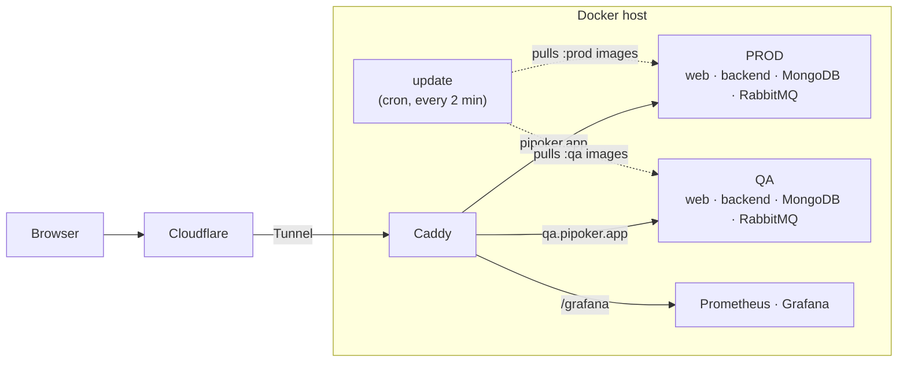
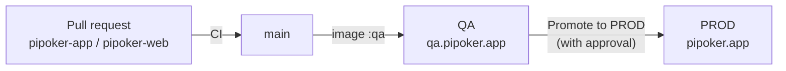

<div align="center">


# PiPoker infrastructure

**How [PiPoker](https://pipoker.app/?from=github) runs, ships and is checked: QA and PROD on one Docker host, live end-to-end tests
and uptime monitoring.**

[**pipoker.app**](https://pipoker.app/?from=github) &nbsp;·&nbsp;
[Backend](https://github.com/LordDetson/pipoker-app) &nbsp;·&nbsp;
[Web client](https://github.com/LordDetson/pipoker-web)

[](https://github.com/LordDetson/pipoker-docker-config/actions/workflows/test.yml)
[](https://github.com/LordDetson/pipoker-docker-config/actions/workflows/live-e2e.yml)
[](https://github.com/LordDetson/pipoker-docker-config/actions/workflows/monitor.yml)
[](https://pipoker.app/?from=github)
[](LICENSE)

[](https://lorddetson.github.io/)


</div>

## What's inside

The application code lives in [pipoker-app](https://github.com/LordDetson/pipoker-app) (backend) and
[pipoker-web](https://github.com/LordDetson/pipoker-web) (web client). Their GitHub Actions build and test every pull
request and publish images to GitHub Container Registry from main. Everything that runs and checks them is here:

| Path | What it is |
|------|------------|
| 🖥️ [`server/`](server/README.md) | The QA and PROD environments on one Docker host: compose files, Caddy, the Cloudflare Tunnel, the update script that pulls new images, Prometheus and Grafana. Its README describes the setup, releases and checks. |
| 🎭 [`e2e/`](e2e) | Live end-to-end tests with Playwright in Chrome, Firefox, Safari and on phones (iPhone and Android), plus a load test. |
| ✅ [`test.yml`](.github/workflows/test.yml) | Starts the whole server from `server/` on every pull request and checks QA and PROD with `server/check`. |
| 🔁 [`live-e2e.yml`](.github/workflows/live-e2e.yml) | Runs `e2e/` against QA, or against pipoker-app and pipoker-web branches started the way the server does. |
| 📟 [`monitor.yml`](.github/workflows/monitor.yml) | Checks PROD every 5 minutes and reports an outage by an issue and a Telegram message. |

## How it runs



The server connects out to Cloudflare, so it needs no public IP and no open ports, and GitHub never connects to it:
it pulls new images itself.

## Releases



1. Every push to main of pipoker-app and pipoker-web publishes images tagged `qa`; the server runs them on QA within
   a few minutes.
2. A commit checked on QA is tagged `prod` by the **Promote to PROD** workflow in its repository, which waits for
   approval.
3. The server picks up the `prod` image on its next update.

## Getting started

Setting up a server from scratch takes a Linux machine with Docker, a domain on Cloudflare and a few `.env` files.
The step-by-step guide is in [`server/README.md`](server/README.md).

To run the live tests against your own stack:

```bash
cd e2e
npm ci
npx playwright install --with-deps
BASE_URL=http://localhost npx playwright test   # QA by default
```

## License

PiPoker is released under the [Apache License 2.0](LICENSE).
